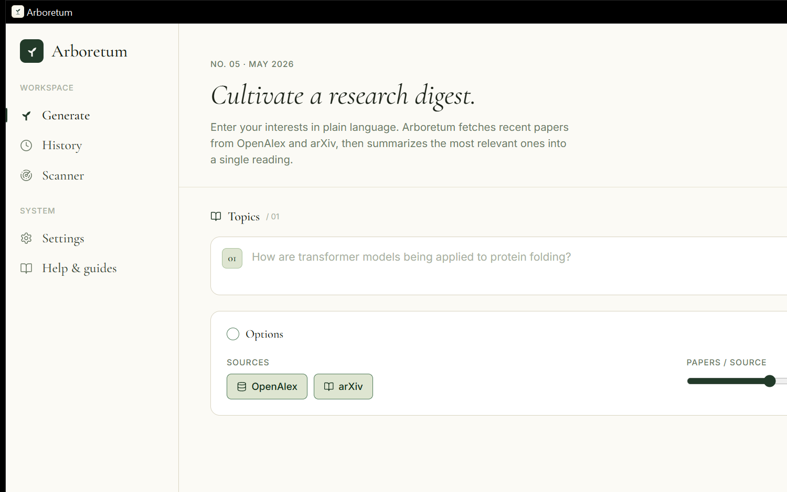

# Arboretum

> A desktop app that grows daily research digests from OpenAlex and arXiv — curated by AI, delivered to your inbox.

[](LICENSE)


Arboretum is what happens when you stop trying to keep up with the literature by hand. Type a research interest in plain language — *"hierarchical Bayesian small-area estimation"*, *"foundation models for protein design"*, *"causal inference in panel data"* — and Arboretum:

1. Turns it into an academic search query and a newsletter title.
2. Searches OpenAlex (250M+ works) and arXiv for recent papers matching it.
3. Asks an LLM to pick the ten most relevant, summarise each in plain English, and tag it.
4. Saves the result as Markdown to your machine.
5. (Optionally) emails it to you on a Windows/macOS scheduled task — even with the app closed.

The same machinery powers a **conflict scanner**: define a profile describing your own work, and Arboretum scans recent literature for potentially overlapping or competing papers, scoring each 0–100 and surfacing the threats above a threshold you set.



---

## Why

Most paper-discovery tools fall into two buckets: passive (RSS feeds, journal TOC emails — too noisy, too tied to one venue) and active (Google Scholar alerts, manual search sessions — too time-consuming, easy to drop). Arboretum sits between them: you specify what you care about once, in your own words; the app does the legwork once a week or once a day, and you read a quiet two-page editorial summary instead of triaging fifty subject lines.

It was built around a few opinions:

- **Local-first.** Newsletters live as Markdown files on your disk. No cloud account, no vendor lock-in, no sign-up.
- **Bring-your-own AI.** Use the Anthropic API, the Gemini API, or a fully local Ollama model — your choice, your key, your privacy posture.
- **Editorial, not dashboard.** The UI uses a Paper/Forest theme system with serif and small-caps typography, designed to feel like a reading room rather than another notification surface.

---

## Features

### Generation
- **Plain-language topics.** Type what you care about; the model writes the search keywords for you.
- **Multi-source.** OpenAlex (cross-disciplinary, abstract-rich) and arXiv (pre-prints), independently toggleable per run.
- **Multi-topic parallelism.** Queue several digests and Arboretum runs them concurrently.
- **Live progress.** Per-step status streams into the UI as it works. For the local provider you also get a live tokens/sec readout.
- **Filename collision handling.** Multiple newsletters on the same day land as `newsletter-2026-05-26.md`, `newsletter-2026-05-26-2.md`, …

### Conflict scanner
- Define a **research profile** (description + key terms) and Arboretum runs a multi-query scan (primary + method-specific + broad-domain queries) to surface recent papers that may overlap with your work.
- Each candidate is scored 0–100 with a threat tier (`low` / `moderate` / `significant` / `critical`) and an explanation of *how* it overlaps vs. *how* it differs.
- Configurable threshold + a "scan with every newsletter run" toggle.

### Delivery
- **HTML email.** Markdown is rendered to multipart HTML + plain-text via [`pulldown-cmark`](https://github.com/raphlinus/pulldown-cmark) and sent over SMTP (STARTTLS) with [`lettre`](https://github.com/lettre/lettre).
- **Provider wizard.** Gmail / Outlook / iCloud / Custom — the wizard auto-fills host & port and links to the right app-password docs. A *Test connection* button does a full TLS+auth handshake before saving.
- **Scheduled runs.** Arboretum installs a **native** scheduled task — Windows Task Scheduler (`schtasks.exe`) on Windows, a `launchd` plist on macOS — that wakes the app in headless `--scheduled-run` mode, generates the digests, sends the email, and exits. No background daemon required.

### Security & privacy
- API keys and SMTP passwords are stored in the platform's secret store, **never in the JSON config**:
  - **Windows** — DPAPI-encrypted blob in `%APPDATA%\com.research.newsletter\secrets.json`. Ciphertext is bound to your Windows user.
  - **macOS** — login keychain under service `com.research.newsletter`.
  - **Linux** — plaintext sidecar with a `stderr` warning (libsecret integration on the to-do list).
- Legacy plaintext configs auto-migrate on first read; the keys are stripped from `config.json`.
- Arboretum only sees **abstracts** (truncated to ~600 chars). Full-text PDFs are never fetched.

---

## Tech stack

| Layer | Choice | Why |
|-------|--------|-----|
| Desktop shell | [Tauri v2](https://tauri.app) | System WebView (no Chromium) → small bundle (~10 MB), low memory, native menus/notifications. |
| Frontend | React 18 + TypeScript + Tailwind | Familiar component model; Tailwind drives a custom Paper/Forest design-token system via CSS variables. |
| Backend | Rust + `tokio` | Concurrent topic generation + cancel-safe streaming progress events without GC pauses. |
| HTTP | `reqwest` 0.12 (rustls-tls) | Pure-Rust TLS, no OpenSSL dependency on Windows. |
| AI — Claude | Anthropic Messages API (`claude-sonnet-4-6`) | Strongest balance of quality and cost for editorial-style summaries. |
| AI — Gemini | Gemini 2.5 Flash via REST | Lower-cost option with long context; same prompts as Claude. |
| AI — Local | Ollama (default: `qwen3:4b`, auto hardware-tiered) | Fully offline path; the app detects RAM/CPU and recommends a fitting model. |
| Paper sources | OpenAlex REST + arXiv Atom feed | Free, no API key, broad coverage. |
| Email | `lettre` 0.11 + `pulldown-cmark` | Multipart HTML+plain, STARTTLS, SMTP-AUTH. |
| Scheduling | Windows Task Scheduler / macOS `launchd` | Native — Arboretum can be closed when a digest fires. |
| Secrets | DPAPI / Keychain | Platform-standard credential protection. |
| Tests | Vitest (frontend) + `cargo test` (backend) | 28 frontend tests + Rust unit tests, all clean on every push. |

---

## Getting started

### Prerequisites

- **Rust** (stable; MSVC toolchain on Windows) — [rustup.rs](https://rustup.rs)
- **Node.js** 18+
- **Windows only:** [Visual Studio Build Tools](https://visualstudio.microsoft.com/visual-cpp-build-tools/) with *Desktop development with C++* (for the MSVC linker)
- At least one of:
  - An [Anthropic API key](https://console.anthropic.com/settings/keys), **or**
  - A [Gemini API key](https://aistudio.google.com/apikey), **or**
  - [Ollama](https://ollama.com) installed locally

### Build & run

```bash
# Install frontend dependencies
npm install

# Run in development mode (hot-reload on http://localhost:1420)
npm run tauri dev

# Build a production bundle
npm run tauri build
# Windows: src-tauri/target/release/bundle/{msi,nsis}/
# macOS:   src-tauri/target/release/bundle/{dmg,macos}/
```

### First-run configuration

1. Launch Arboretum.
2. Open **Settings → AI provider** and pick Claude, Gemini, or Local.
3. Paste your API key (or download a local model from the in-app picker).
4. Optionally set **Output directory** (defaults to `Documents/newsletters`).
5. (Optionally) configure **Email** via the provider wizard and **Schedule** for unattended runs.
6. On the **Home** tab, add one or more topics and click *Generate*.

---

## How it works

```
            ┌─────────────────┐
   topic ─▶ │  AI: keywords   │ ─▶ search string + newsletter title
            └─────────────────┘
                     │
                     ▼
         ┌────────────────────────┐
         │  OpenAlex  +  arXiv    │ ─▶ up to 60 papers
         │      (parallel)        │
         └────────────────────────┘
                     │
                     ▼
            ┌─────────────────┐
            │  AI: curation   │ ─▶ pick 10, summarise, tag
            └─────────────────┘
                     │
                     ▼
       ┌────────────────────────────┐
       │ newsletter-YYYY-MM-DD.md   │
       └────────────────────────────┘
                     │
              ┌──────┴──────┐
              ▼             ▼
        HTML email     History viewer
```

The AI is asked for **Markdown** with `##` headings linked to paper URLs, paragraph summaries, and `**bold**` relevance tags. The same module powers the conflict scanner — same prompts in `gemini.rs`, mirrored in `claude_api.rs` and `local_llm.rs`, so output shape is consistent across providers.

---

## Configuration reference

| Setting | Where it lives | Notes |
|---------|----------------|-------|
| `ai_provider` | `config.json` | `"claude"` \| `"gemini"` \| `"local"` |
| `claude_api_key` | OS secret store | sanitised from `config.json` on save |
| `gemini_api_key` | OS secret store | sanitised from `config.json` on save |
| `local_llm.{host,model,num_ctx,…}` | `config.json` | Default `qwen3:4b` at `127.0.0.1:11434` |
| `output_dir` | `config.json` | Default `~/Documents/newsletters` |
| `default_sources` | `config.json` | `["openalex", "arxiv"]` |
| `default_max_papers` | `config.json` | 10–100 |
| `default_days_back` | `config.json` | 7–365 |
| `email.{smtp_host,…,recipient}` | `config.json` | password lives in secret store |
| `schedule.{frequency,days,time}` | `config.json` | Reflected into Task Scheduler / launchd on save |
| `conflict_profiles[]` | `config.json` | Per-profile description + key terms + own papers |
| `conflict_settings.competition_threshold` | `config.json` | 0–100; papers above are flagged |

Config file location:

- **Windows** — `%APPDATA%\com.research.newsletter\config.json`
- **macOS** — `~/Library/Application Support/com.research.newsletter/config.json`
- **Linux** — `$XDG_CONFIG_HOME/com.research.newsletter/config.json`

---

## Project structure

```
arboretum/
├── src/                              # React frontend
│   ├── pages/                        # Home · History · Scanner · Settings · Help
│   ├── components/                   # Cards, wizards, primitives (Serif, SmallCaps, WoodRings…)
│   ├── lib/                          # Tauri API wrappers, theme, generation/conflict contexts
│   └── styles/                       # Tailwind entry, Paper/Forest CSS variables
├── src-tauri/                        # Rust backend
│   └── src/
│       ├── lib.rs                    # Tauri commands & app entry
│       ├── main.rs                   # Headless --scheduled-run entry point
│       ├── pipeline.rs               # Generation pipeline, filename collision, footer
│       ├── gemini.rs                 # Gemini REST client (canonical prompts)
│       ├── claude_api.rs             # Anthropic Messages API client
│       ├── local_llm.rs              # Ollama client + token streaming
│       ├── hardware.rs               # RAM/CPU-aware local-model recommendations
│       ├── conflict.rs               # Multi-query conflict scanner pipeline
│       ├── scheduler.rs              # Windows Task Scheduler / launchd glue
│       ├── email.rs                  # SMTP via lettre, Markdown → HTML
│       ├── secrets.rs                # DPAPI / Keychain credential storage
│       ├── config.rs                 # AppConfig struct, load/save, secret migration
│       └── sources/                  # OpenAlex + arXiv API clients
└── scripts/quality-test/             # Dev harness: cloud vs. local quality comparison
```

---

## Development

```bash
npm run test                                              # Vitest frontend tests (28/28)
npx tsc --noEmit                                          # Type-check the frontend
cargo check --manifest-path src-tauri/Cargo.toml          # Rust typecheck
cargo test  --manifest-path src-tauri/Cargo.toml          # Rust unit tests (MSVC linker needed on Windows)
npm run generate:icons                                    # Re-rasterise the desktop icon from icon-master.svg
```

### Quality comparison harness

`scripts/quality-test/harness.py` runs the same curation and conflict-scan prompts against a cloud baseline (Claude or Gemini) and a local Ollama model, then writes a JSON summary comparing speed, output length, and JSON-schema adherence. Useful when picking a local model.

```bash
ANTHROPIC_API_KEY=sk-ant-… uv run --with httpx scripts/quality-test/harness.py
# or
BASELINE=gemini GEMINI_API_KEY=AIza… uv run --with httpx scripts/quality-test/harness.py
```

---

## Roadmap

- [ ] Generation cancellation (Tauri command + stop button)
- [ ] Zotero export (papers → library, curated set → collection)
- [ ] Newsletter preview before saving
- [ ] Markdown → PDF / HTML export
- [ ] libsecret / Secret Service backend for Linux
- [ ] First-class help-guide MDX content

---

## License

MIT — see [LICENSE](LICENSE).
